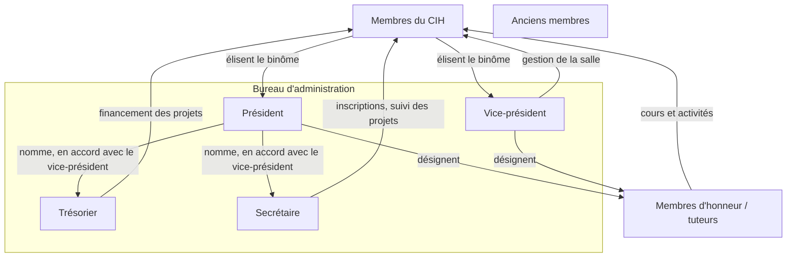

# Organigramme du CIH

*Explication des différents rôles du Club Informatique de Hoche (CIH).*

## 1. Attribution des rôles

Le bureau d'administration du CIH est composé d'un **président**, d'un **vice-président**, d'un **trésorier** et d'un **secrétaire**.

- Les membres du CIH élisent un **binôme président / vice-président**.
- Les élections se déroulent en fin d'année et sont dirigées par le président encore en fonction.
- Le **trésorier** et le **secrétaire** sont nommés après les élections par le président, en accord avec le vice-président.

**Sont éligibles les membres :**

- inscrits et ayant payé la cotisation ;
- étant en classe de seconde ou de première (et donc encore au lycée durant leur mandat).

## 2. Rôle du président

- Le président est avant tout le **représentant de l'ensemble du CIH auprès de l'administration**. C'est pourquoi il doit être élu démocratiquement par vote.
- En vertu de ce statut, il préside le jugement de tout membre en cas de dérive.
- Ce statut de représentant ne lui donne **pas les pleins pouvoirs** : il doit consulter les membres du CIH pour chaque décision majeure.

## 3. Rôle du vice-président

- Le vice-président veille au respect de la charte dans la salle du CIH et empêche les abus. Plus généralement, il **gère la salle du CIH**.
- Il est intrinsèquement lié au président et peut parler en son nom.
- Le président lui restant hiérarchiquement supérieur, il peut contredire les mesures prises par le vice-président si le bureau est d'accord.

## 4. Rôle du trésorier

- Le trésorier est responsable de la **tenue des comptes** du CIH, avec un **devoir de transparence**. Il est garant de l'équilibre budgétaire du club.
- Il gère le financement des projets proposés par les membres.

**Processus de financement d'un projet :**

1. Un groupe de membres propose un projet et demande un budget au trésorier.
2. Le trésorier vérifie la faisabilité du projet et la cohérence du budget demandé.
3. Une fois le trésorier et le groupe d'accord, le groupe soumet son projet au président.
4. Le président ne peut le refuser que pour des **raisons légales** ou de **non-respect de la charte**.

> Le trésorier est donc le véritable gérant des projets ; le président n'intervient qu'en cas de dérive. Cette politique vise à faciliter la création de projets et à dynamiser la vie du club.

## 5. Rôle du secrétaire

- Le secrétaire est responsable de la **partie administrative** du CIH : inscription des nouveaux membres, rédaction, suivi des propositions de projets des membres.

## 6. Rôle des membres d'honneur (tuteurs)

- Les membres d'honneur, ou tuteurs, sont des membres qui se distinguent par leurs compétences et qui sont désignés pour les transmettre aux autres membres, dans le cadre de la politique de transmission de la connaissance du CIH.
- Ils organisent des cours et des activités dans leur domaine de compétence, afin de faire progresser les membres intéressés.
- Ils sont désignés par le président ou le vice-président.

> Le titre de membre d'honneur / tuteur est à considérer comme une **responsabilité** plutôt que comme un honneur.

## 7. Rôle des membres

- Les membres sont invités à participer aux projets du CIH et à être présents lors des initiations.
- Tout membre ou groupe de membres peut faire une **proposition de projet** : le projet est présenté au trésorier, et son lancement est supervisé par le secrétaire.

## 8. Rôle des anciens membres

- Par ancien membre, on entend toute personne ayant été membre et souhaitant rester en contact avec le club.
- Ces membres peuvent **exceptionnellement** entrer dans le lycée, pour certains rares événements importants.

## 9. Organigramme

## 10. Accès et modification des rôles

- Pour l'instant, **tous les membres ont accès aux clés** de la salle du CIH (voir la [Charte](Charte.md), section « Accès et clés »).
- Pour changer les responsabilités et les droits de chaque rôle, il faut **réunir le bureau d'administration du CIH**.
